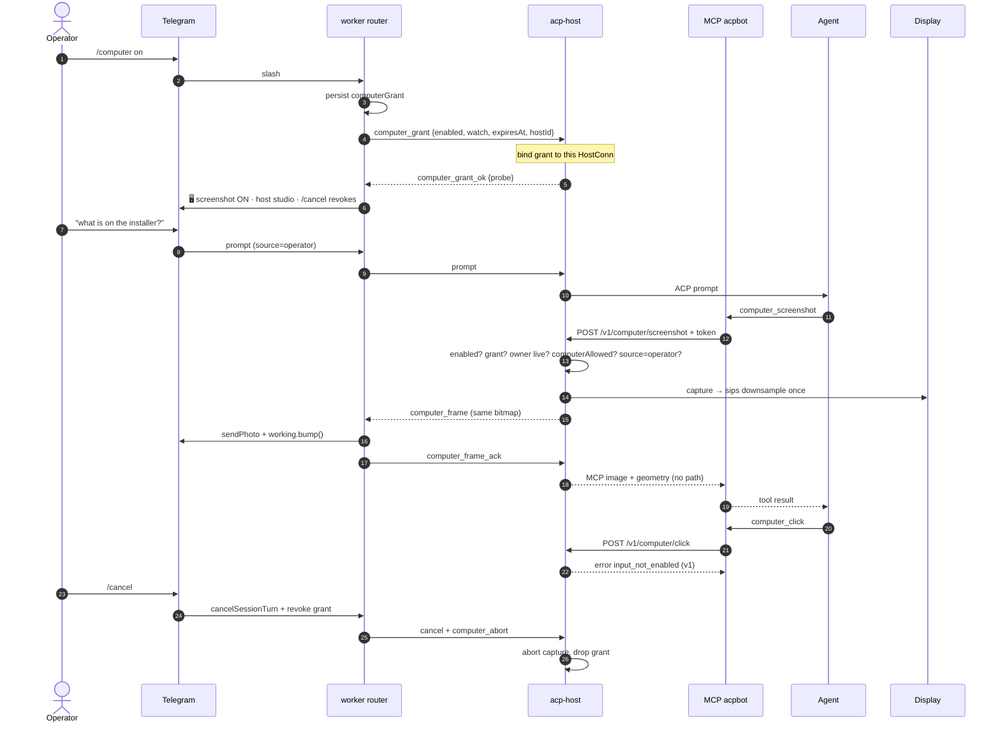

# Computer Use for acpbot

| Field | Value |
|---|---|
| **Author** | acpbot design (revision 3) |
| **Date** | 2026-08-17 |
| **Status** | Draft — **v1 locked to isolated browser (user 2026-08-17)** |
| **Audience** | Senior engineers familiar with acpbot’s worker / acp-host / ACP split |

---

## User decision addendum (2026-08-17) — browser-only v1

The operator chose **start with browser control only**. This addendum **overrides** login-session screenshot as v1 and **overrides** “input is not in v1.” Everything else in this document (host-owned executor, grant, live worker, host-api token, `computerAllowed`, three-path permissions, frames via `slot.owner`, no `framePath`) still stands.

### Overrides

| Was | Now |
|---|---|
| D9 mergeable v1 = screenshot the **login session** | D9′ mergeable v1 = **isolated Playwright browser** on the acp-host. The agent never sees or clicks the operator’s desktop. |
| D20 input blocked until isolated display / confirm-every / residual-risk | D20′ **satisfied by isolation.** Click / type / key / scroll / navigate are **in v1**, but only inside that browser. Desktop HID remains out. |
| PR 3 = macOS `screencapture` | PR 3 = Playwright backend (screenshot **and** input) |
| PR 4 = desktop HID after D20 | **Dropped** from this execution |
| PR 5 / 5b Linux desktop / optional Playwright | Playwright **is** the v1 backend (this plan’s PR 3) |
| Banner “cannot click or type yet” | Banner: agent can drive **this topic’s browser**, not the desktop |
| Setup TCC Screen Recording | Setup: enable `[computer]`, check Playwright/Chromium availability |
| `display = "login"` | `display = "browser"` |

### Browser product

- One **headed-or-headless Chromium** (default **headless**) per granted slot, owned by the host supervisor. Destroyed on grant revoke, `/cancel`, owner disconnect, TTL expiry, host `[computer].enabled` off.
- New tool: **`computer_navigate`** `{ url }` (http/https only). First action after grant if no page yet: agent must navigate (or screenshot a blank “no page” JPEG).
- Existing tools against the **browser viewport** (not the OS display): `computer_screenshot`, `computer_click`, `computer_move`, `computer_drag`, `computer_scroll`, `computer_type`, `computer_key`, `computer_status`.
- Coordinate space = the downsampled viewport JPEG (`frameId`). Same bitmap to agent + Telegram. TOCTOU: if navigation or viewport size changed since `frameId`, abort + recapture + `stale_frame`.
- No `computer_screenshot({ display })` for OS monitors. Optional `computer_screenshot({ fullPage: false })` only (viewport). No full-page stitch in v1 (Telegram size).
- Playwright is **runtime-optional**: `playwright-core` (or `playwright`) launching **system Chrome** (`channel: "chrome"`) or a previously `npx playwright install chromium` browser. **Do not** bundle Chromium into the acpbot release binary. Missing browser → probe `{ ok: false, backend: "playwright", missing: ["chromium"] }`; tools fail closed with that message.
- No native addons. Playwright is JS; browser is an external process the host already may have.
- Isolated profile: each slot gets its own user-data dir under `$state_dir/computer-browser/<slotKey>/` mode `0700`. Deleted on revoke. Do not share cookies with the operator’s real Chrome.
- Network: default allow. v1 does not add a URL allowlist (operator is watching frames). Open question later.

### Config override

```toml
# [computer]
# enabled = false
# display = "browser"           # v1: isolated Playwright only
# publish_frames = "on_action"
# jpeg_quality = 60
# max_edge_px = 1280
# max_actions_per_turn = 40
# min_action_interval_ms = 150
# grant_ttl_sec = 1800
# watch_interval_ms = 2500
# frame_coalesce_ms = 2000
# browser_channel = "chrome"    # chrome | chromium | msedge
# browser_headless = true
```

`ACPBOT_COMPUTER=0` still forces off.

---

## Overview

acpbot is a Telegram control surface for ACP coding agents. Today an agent can read/write files, run shells, and send photos — but it cannot **see** a GUI. Operators still do “does this installer look right?” themselves.

This design adds **computer use**. The **mergeable v1** is **screenshot-only**: the agent running on a given **acp-host** can capture that host’s login display, and the operator sees the same JPEG in the Telegram topic. **Pointer and keyboard are not in v1.** Input is a later increment and may ship only after one of: (a) an isolated virtual display, (b) `confirm_every_action` on every HID call, or (c) an explicit residual-risk accept recorded as a Key Decision (D20). Until then, `computer_click` / `type` / `key` fail closed.

The executor lives on the host (the machine with the display). The worker never holds display access and never lets the bot token leave its process. Frames travel host → worker over the existing NDJSON/WSS control plane (the `eve_notify` pattern, published to **`slot.owner`**, not the EVE client), then reuse `TelegramPort.sendPhoto({ data })`. They do **not** go through path-based `telegram_send_photo`, and they are **never** exposed as a filesystem path the agent can `fs/read`.

Default is **off**. Two independent opt-ins: host config `[computer].enabled = true`, then a per-topic `/computer on` grant. Computer-use permissions are **never** auto-allowed by `permission_mode = bypass` on **any** of the three bypass sites (session-host, acp-host hooks, worker daemon). **`/cancel` revokes the grant** (panic). HID — when it exists — **must not run** without a live worker that has ACKed frames.

---

## Background & Motivation

### Current state

```text
You (Telegram) ──topic──► worker ──ACP/NDJSON──► acp-host ──stdio──► grok | claude | …
```

Relevant surfaces already in tree:

| Surface | Path | What it gives us |
|---|---|---|
| Built-in MCP `acpbot` | `src/mcp/server.ts` | Agent-facing tools (`update`, `telegram_send_photo`, `agent_*`, …) |
| Worker Unix API | `src/mcp/worker-api.ts`, `src/core/worker-api-server.ts` | MCP → Telegram without the bot token |
| Host-side fs/terminal gates | `requireHostSidePermission` in `src/acp/session-host.ts` | Telegram Allow/Reject even when the agent skips `request_permission` |
| Plan-exit force-ask | `isPlanExitPermission` in `src/acp/permission-map.ts` | Bypass never auto-leaves plan — **in three independent sites** |
| Unsolicited host → worker | `eve_notify` in `src/acp-host/protocol.ts` | Precedent for host → worker events over Unix **and** WSS |
| Multi-host routing | `resolveHostId` in `src/acp-host/hosts.ts` | Repo → host id; no silent local fallback |
| Two host clients | `src/env/real-agents.ts` router vs `eveHost` in `src/core/daemon.ts` | Session RPCs go through the **router**; EVE notify is a **separate** client |
| macOS TCC probe | `src/setup/macos-fda.ts` | Probe + open System Settings + name the **resolved binary** |
| Working bubble | `src/core/working-status.ts` | One live `⏳`/`❓` message; `bump()` after photos |
| Photo pipeline | `TelegramPort.sendPhoto({ data })` | Bytes in, Bot API out. `TELEGRAM_PHOTO_MAX_BYTES = 10 MiB` (`src/mcp/repo-path.ts`) |

### Pain points

1. **GUI is a hole in the control surface.** OAuth consent screens, browser-only admin UIs, native installers, visual QA — the agent can only ask the human to look.
2. **Vendor computer-use is agent-specific.** Claude CUA / OpenAI operator / any Grok equivalent would give *one* adapter a capability the others lack, and would bypass acpbot’s permission / Telegram UX.
3. **A raw nut.js (or Playwright) MCP in `.acpbot/mcp.json` does not fit.** It would run as an agent-spawned stdio child with no host-side gate, no `/cancel` abort, no operator-visible frames, and — on multi-host — no working path to Telegram.
4. **Existing outbound photos are same-machine only.** `telegram_send_photo` resolves a repo path on the **host**, then the **worker** does `readFile(path)` (`src/core/daemon.ts` `sendPhoto` handler). That is already broken for `[repos.work].host = "studio"`. Computer use must not inherit that bug.
5. **`fs/readTextFile` is unjailed.** `handleReadTextFile` in `src/acp/session-host.ts` reads any path with no permission and no repo jail. A `framePath` in a tool result would leak password-manager pixels across sessions. Computer use must not use that hole.

### Why now

The control plane we need already exists: session-scoped grants, force-ask permissions (three sites), host → worker unsolicited events, and a photo send that accepts **bytes**. Screenshot-only is a new capability on those rails. HID is a separate, gated product.

---

## Goals & Non-Goals

### Goals (mergeable v1 — screenshot only)

- Agent can **screenshot** the **acp-host machine that owns the session’s repo**. Operator **sees the same bitmap** in the topic.
- Operator can **stop instantly**. `/cancel` **revokes the grant** and aborts capture. `/computer off` does the same without cancelling the coding turn.
- Default **off**. Host master switch + per-session grant. Never auto-enabled by `bypass`.
- Same capability for **every** ACP agent via host-owned MCP tools.
- Works with **multi-host**: frames come from `studio` when `[repos.work].host = "studio"`, never the worker laptop.
- Supervisor **refuses** every computer action unless `slot.owner` is the live `HostConn` that sent the current `computer_grant`.
- Fits `Environment` fakes + a host-side `ComputerUseBackend` so tests need no display.
- **macOS is the v1 platform** (Screen Recording TCC, `screencapture`, `sips` for resize). Linux is **best-effort after macOS**, not an equal v1 goal.
- Incremental, independently mergeable PRs. **Input PRs do not land until the input gate (D20) is decided in writing.**

### Non-goals (v1)

- **Pointer, keyboard, drag, scroll, type** on a login session. Those are a later increment under D20.
- **Windows.**
- **Isolated virtual framebuffer as a v1 requirement.** It remains the preferred *input* gate (D20-a), not a blocker for screenshot-only.
- **Browser-only Playwright as the v1 product.** Optional backend (PR 5b) if desktop HID slips; same supervisor.
- **Vendor-native CUA** as the transport.
- **Fixing all MCP Telegram tools for multi-host.** Computer-use frames use the host protocol.
- **Headless children, scheduled fires, and EVE leaves** getting computer use. `computerAllowed` defaults **false**. Schedule/EVE turns set `slot.turnSource` so even a granted operator slot cannot capture mid-cron.
- **HID injection into other users’ sessions, VNC we don’t own, or mobile.**
- **`publish_frames = "off"`** while any input exists. v1 publishes `on_action` only.
- **Filesystem `framePath` / `fs/read` of screenshots.** Frames live in supervisor memory. Disk, if used for debug, is host-only and never mentioned in tool results.
- **Pixel-perfect AX trees / DOM dumps** as a required input.

---

## Key Decisions

| # | Decision | Rationale |
|---|---|---|
| D1 | **Host-owned tool surface**, not vendor CUA | Every ACP agent gets the same tools. Vendor APIs skip Telegram permissions. |
| D2 | **Executor lives in acp-host**, MCP tools are a thin RPC | Same reason `terminal/*` is in `session-host.ts`. Cancel, grant, and audit need one control plane. |
| D3 | **MCP `computer_*` tools** (not ACP client methods, not a repo MCP) | Agents already discover host tools via injected `acpbot` MCP. A repo nut.js MCP would skip gates. |
| D4 | **Host-minted per-slot host-api token; Bearer on every request** | Host generates `crypto.randomBytes(32)` base64url on **first live slot create**, stores it on `Slot`, injects `ACPBOT_HOST_API_TOKEN` via `buildSessionMcpServers` env. Reuse on reattach. Rotate only on `forceRespawn` / `forceNewSession` (MCP rebuilt). **Not** on worker `HostAgentConfig`. MCP sends `Authorization: Bearer`. `sessionKey` is routing. `chmod 0600` is defense-in-depth only. |
| D5 | **Frames travel host → `slot.owner` as `computer_frame`**, then `TelegramPort.sendPhoto({ data })` | Path-based `telegram_send_photo` is same-machine only. Do **not** hang this on the EVE client (`eveHost` in `daemon.ts`). |
| D6 | **Two-key enablement**: `[computer].enabled` + per-topic `/computer on` | Config alone must not start capturing. |
| D7 | **Session grant + screenshot stream for v1 capture** | Capture is read-only of the display. Per-frame Telegram approval would make “look at this” unusable. HID, if it ships, is gated separately (D20). |
| D8 | **Never honor `bypass` for computer use — all three sites** | Plan-exit is forced in `session-host.ts` `askSharedPermission`/`handlePermission`, `acp-host/server.ts` `makeHooks`, and `daemon.ts` `handlePermissionRequest`. Computer-use must thread the same three. Do **not** reuse `requireHostSidePermission` until its early `bypass` return is fixed (`forceAsk`). Unique fingerprint per confirm (copy `plan-exit:${sessionKey}:${toolCallId}`). Never `allow_always` → session bypass. |
| D9 | **Mergeable v1 = screenshot-only on the login session** | Login-session HID with only TTL + budget + after-the-fact JPEGs is unsupervised RCE on the operator desktop. Capture is still useful (visual QA, “what is on studio?”) and does not click 1Password. |
| D10 | **No native Node addons. HID, if any, is same-binary** | Shipped artifact is one Bun binary (`scripts/release-darwin.sh`). No `cliclick` fallback (TCC would attach to *that* executable). No separate `acpbot-hid` unless it is added to the Darwin release, codesigned, and named in setup. Prefer in-process / `acpbot` helper so Screen Recording + Accessibility land on `resolveExecutable("acpbot")`. |
| D11 | **Headless / schedule / EVE cannot use computer use** | `computerAllowed` default **false**. Worker sets true only via `ensureSessionWithPerms` when `session.headless !== true`. **Do not** flip `computerAllowed` or drop the conn-bound grant on `ensureSlotForSchedule`. Supervisor allows capture only when `slot.turnSource === "operator"` (tagged at the start of **every** turn — not only on `WorkerToHost prompt`). |
| D12 | **Screenshots never land in the repo, `/tmp`, or a tool-result path** | Supervisor memory is the frame store. Capture temp files live under `$state_dir/computer-tmp/` (mode `0700`) and are `unlink`ed in `finally`. Never `/tmp` (world-readable). Never mention a path to the agent. `handleReadTextFile` is unjailed — do not build on that. |
| D13 | **Live worker required for every computer action** | WSS close today only nulls `slot.owner` and leaves the agent running (`src/acp-host/server.ts`). `fireScheduledPrompt` does not require a worker. Supervisor refuses unless `slot.owner` is the live `HostConn` that sent the **current** `computer_grant`. On owner disconnect: abort, drop memory grant, stop watch. Input additionally requires a worker ACK of at least one `computer_frame` on this grant. |
| D14 | **`/cancel` revokes the grant (panic)** | Operators treat `/cancel` as stop-everything. Banner and status must match. `/steer` does **not** revoke (interrupt + keep watching). `/fresh` revokes. |
| D15 | **Same bitmap for agent, Telegram, and annotation** | Capture → downsample **once** (macOS `sips`) → that buffer is `frameId`. Telegram must not get a second resize. Crosshairs and clicks share coordinates. |
| D16 | **v1 `publish_frames` is `on_action` only** | `off` plus a session grant is unsupervised HID (and unsupervised capture of secrets with no operator copy). Do not put `off` in `config.example.toml`. If `off` is ever added, it implies screenshot-only (no pointer/key). |
| D17 | **Always register `computer_*` tools; supervisor fail-closed** | MCP tools are static at child start (`src/mcp/server.ts`). Hot-reload cannot add/remove them without respawn. Tools exist and return “disabled / no grant / no owner.” Flipping `[computer].enabled` off aborts grants immediately. |
| D18 | **macOS is v1; Linux is best-effort later** | `grim` is wlroots, not GNOME. `ydotool` needs `ydotoold` + uinput. `/dev/fb0` is dropped (wrong coordinates). Orb VMs used for multi-host e2e typically have no GUI. |
| D19 | **Revoke grant when `resolveHostId` changes — worker-side only** | Host ids (`local`, `studio`) exist only in the **worker** catalog (`resolveHostId`). The host process has no catalog id (`hello` is a token, not a name). Worker sends `computer_abort` to the **previous** host **client** and clears `PersistedSession.computerGrant`. |
| D20 | **Input ships only after an explicit gate** | One of: **(a)** isolated virtual display, **(b)** `confirm_every_action` for every pointer/key, or **(c)** written residual-risk accept (login-session HID + live-worker + no schedules + `on_action` frames + TOCTOU abort). PR 4 does not merge until this is recorded. TOCTOU: if frontmost window title/bounds changed since `frameId`, abort and recapture. |
| D21 | **Host does not compare catalog host ids** | Supervisor trusts any grant on the live `HostConn` that sent `computer_grant`. It does **not** evaluate `grant.hostId` against “this process’s host id” (that id does not exist on acp-host). `grant.hostId` is worker bookkeeping for D19 routing only. |

---

## Proposed Design

### Architecture

```text
Telegram topic
      │
      ▼
┌─────────────────────────────────────────────────────────────┐
│  worker  (bot token, topics, /computer grant, sendPhoto)    │
│  src/core/daemon.ts  +  real-agents host router             │
└───────────────┬─────────────────────────────┬───────────────┘
                │ NDJSON Unix or WSS          │
                │ computer_grant / abort      │ computer_frame → slot.owner
                ▼                             │
┌─────────────────────────────────────────────┴───────────────┐
│  acp-host   (owns display, executor, host-api.sock)         │
│  ComputerUseSupervisor + ComputerUseBackend                 │
│  refuse unless owner === grant.conn                         │
└───────────────┬─────────────────────────────┬───────────────┘
                │ stdio ACP                   │ HTTP over Unix
                ▼                             ▼
         Agent process                 acpbot MCP child
         (grok / claude / …)           computer_* + HOST_API_TOKEN
                                       (no bot token, no raw HID)
```

The worker still owns Telegram. acp-host still owns agent stdio **and** capture. The MCP child only RPCs the host API with a **capability token**; it does not click and does not hold the bot token.

**Two host clients — do not mix them.**

| Client | Created in | Used for |
|---|---|---|
| Catalog router | `src/env/real-agents.ts` → `createHostRouter` (`src/acp-host/router.ts`) | `ensure` / `prompt` / `cancel` / **computer_grant**. This connection is `slot.owner`. |
| `eveHost` | `src/core/daemon.ts` (~line 2011) | EVE only. `onEveNotify` is wired **only** here. |

`computer_frame` / `computer_status` are published to **`slot.owner` only** (same as `turn_event`). Add `onComputerFrame` / `onComputerStatus` to `AcpHostClientOptions` and plumb them through `createHostRouter` → `real-agents`. **Do not** reuse `eveHost`.



### Component map

| Component | Process | New files (proposed) | Role |
|---|---|---|---|
| `ComputerUseBackend` | acp-host | `src/computer/backend.ts`, `src/computer/fake.ts`, `src/computer/macos.ts`, later `src/computer/linux.ts` | Screenshot (v1). Input methods exist on the port but return `input_not_enabled` until D20. |
| `ComputerUseSupervisor` | acp-host | `src/computer/supervisor.ts` | Grant↔conn binding, owner liveness, budget, turn source, annotate, audit, publish, ACK |
| Host HTTP API | acp-host | `src/acp-host/host-api.ts` | `$state_dir/host-api.sock` — token required |
| MCP tools | MCP child | `src/mcp/server.ts`, `src/mcp/host-api.ts` | `computer_*` always registered; fail closed |
| Protocol | both | `src/acp-host/protocol.ts`, `src/acp-host/client.ts`, `src/acp-host/router.ts`, `src/env/real-agents.ts` | grant/abort/frame/ack/status on the **session** client |
| Worker UX | worker | `src/core/daemon.ts`, `src/core/commands.ts`, `src/core/callbacks.ts`, `src/core/persistence.ts` | `/computer`, grant, `/cancel` revoke, `sendPhoto` |
| TCC setup | setup | `src/setup/macos-tcc.ts` | Screen Recording (v1); Accessibility only when input ships |
| Skill | both | `skills/computer/SKILL.md`, `src/core/bundled-skills-data.ts` | Screenshot-first habits |

### Why not “just add nut.js MCP tools”

A repo MCP (`<repo>/.acpbot/mcp.json` → nut.js) fails four invariants this repo already encodes:

1. **Process boundary.** Agent-spawned MCP children should not hold HID. The bot token stays in the worker for the same reason (`website/src/content/docs/worker-api.md`).
2. **Host-side gates.** Grok often skips `session/request_permission`; `requireHostSidePermission` still prompts. A third-party MCP would not.
3. **Telegram supervision.** nut.js has no frame publisher. `telegram_send_photo` cannot carry host-local JPEGs to a remote worker.
4. **Shipped binary.** nut.js is a native addon. Releases are single Bun binaries (`scripts/release-darwin.sh`).

Playwright-as-MCP has the same control-plane problems. Playwright **as a `ComputerUseBackend`** is a valid later backend (PR 5b), not a second control plane.

### Display model

**v1 (ship): observe the logged-in console session — capture only.**

| Platform | Capture | Input | Notes |
|---|---|---|---|
| macOS (v1) | `/usr/sbin/screencapture -x -t jpg` then `/usr/bin/sips` to max edge 1280 / JPEG q60 | **Disabled** | Screen Recording TCC on the **resolved `acpbot` binary** (`resolveExecutable("acpbot")` in `src/setup/daemon-install.ts`). LaunchAgent **label** is `app.acpbot.host`; the process executable is `acpbot`. Always print the binary path. `acpbot restart` after toggling TCC (FDA already says this). |
| Linux (after macOS) | Detect compositor. wlroots: `grim`. GNOME/KDE: xdg-desktop-portal / refuse with the exact missing portal. X11: ImageMagick `import`. | **Disabled in v1** | **No `/dev/fb0`.** `ydotool` is not `apt install ydotool` — it needs `ydotoold` + uinput udev; say so. Orb VMs (`data/e2e-orb/`) typically have no GUI — do not claim they validate this backend. |

Coordinate space (when input exists): **the downsampled bitmap stored as `frameId`**. That same buffer is sent to the agent (MCP image) and to Telegram. The supervisor records `frameId → { width, height, displayId, scale, frontmostTitle, frontmostBounds }`. Clicks are in that bitmap’s pixels. If the agent clicks without a current frame: “call `computer_screenshot` first”.

**TOCTOU (input increment):** immediately before HID, re-read frontmost window title + bounds. If they differ from the `frameId` metadata, **abort**, recapture, return `stale_frame` to the agent. Do not click stale coordinates because the operator moved a window or a dialog appeared.

The grant banner for v1 says **screenshot**, not click:

```text
🖥 Computer screenshot ON for this topic
Host: studio (studio.local) · display 0 · login session
The agent can SEE this screen (password dialogs, other apps) and
you will get the same JPEG here. It cannot click or type yet.
/computer off  or  /cancel  stops it (grant revoked).
Expires in 30m.
```

### Multi-host: which display?

`resolveHostId` (`src/acp-host/hosts.ts`):

1. Sticky session host id (normally unset)
2. `[repos.<repo>].host`
3. Else `local`

Computer use **always** follows that host. The worker never captures. Status:

```text
🖥 Computer · screenshot ON · host `studio` (studio.local, display 0, 1280×800)
Grant expires in 26m · Watch off · 3 captures this turn
/computer off  ·  /cancel revokes grant
```

If that host is down, `/computer on` fails like `ensure` today: **no silent fallback to local**.

If hot-reload rebinds `[repos.work].host`, the worker **revokes** the grant and sends `computer_abort` to the **previous** host id (D19).

`/status` (`formatSessionStatus` in `src/acp/session-mode.ts`) gains a `computerLine` (same optional-field style as `linearLine`).

### Session grant state

Extend `PersistedSession` (`src/core/persistence.ts`):

```ts
export type ComputerGrant = {
  enabled: boolean;
  watch: boolean;
  /** Epoch ms; 0 = until /computer off */
  expiresAt: number;
  /** Host id the grant was issued against (must match resolveHostId). */
  hostId: string;
  grantedAt: number;
};

export type PersistedSession = {
  // …existing fields…
  computerGrant?: ComputerGrant;
};
```

Grant is **worker-authoritative**. Host caches it **bound to the `HostConn` that sent `computer_grant`**, not as a free-floating slot flag.

```ts
// WorkerToHost
| {
    type: "computer_grant";
    reqId: string;
    slotKey: string;
    grant: {
      enabled: boolean;
      watch: boolean;
      expiresAt: number;
      hostId: string;
    };
  }
| { type: "computer_abort"; reqId: string; slotKey: string }
/** Fire-and-forget. No reqId — must not go through client.request() (600s wait). */
| { type: "computer_frame_ack"; slotKey: string; frameId: string };

// HostToWorker
| {
    type: "computer_grant_ok";
    reqId: string;
    slotKey: string;
    /** PR 1 stub until a real backend exists (PR 2/3). */
    probe: ComputerProbe;
  }
| { type: "computer_grant_err"; reqId: string; slotKey: string; error: string }
| {
    type: "computer_frame";
    sessionKey: string;
    jpegBase64: string;
    caption: string;
    width: number;
    height: number;
    action?: string;
    frameId: string;
    hostId: string;
  }
| { type: "computer_status"; sessionKey: string; text: string };
```

`HostAgentConfig` carries (worker → host on `ensure`):

```ts
computerGrant?: ComputerGrant; // optional cache hint; still requires computer_grant from this HostConn
/** Default false. Worker sets true only for non-headless operator topics. */
computerAllowed?: boolean;
// hostApiToken is NOT here — host mints and injects (D4).
```

A cold `ensure` after reconnect does **not** by itself authorize capture. The supervisor still requires that **this connection** send `computer_grant`. A grant left over from a previous owner is dropped on `close`. `ensureSlotForSchedule` must **not** drop a conn-bound grant and must **not** flip `computerAllowed` on an existing operator slot.

TTL default: **30 minutes**. Expiry disables the grant on both sides; in-flight capture is aborted. Watch does not extend TTL.

`/cancel` → `cancelSessionTurn` **plus** clear `computerGrant` and `computer_abort`. Copy: `⏹ turn cancelled — computer grant revoked`.  
`/fresh` → same revoke.  
`/steer` → abort turn (capture abort via `turnAbort`); **grant remains**.

### Live worker, schedules, EVE

Today (`src/acp-host/server.ts`):

- WebSocket `close` nulls `slot.owner` and **leaves the agent running**.
- `fireScheduledPrompt` (~line 731) and EVE `runLeaf` (~848) call `slot.host.startTurn(...)` **directly**. They never build a `WorkerToHost` `prompt`. Tagging `source` only on the protocol prompt would miss both.
- `ensureSlotForSchedule` **returns the live slot** when agent+cwd match. It does not recreate the slot and must not mutate grant / `computerAllowed`.

**`slot.turnSource` is set at the start of every turn and cleared when the turn ends:**

| Entry point | Sets `slot.turnSource` |
|---|---|
| `runHostPrompt` | `msg.source ?? "operator"` |
| `fireScheduledPrompt` | `"schedule"` |
| EVE `runLeaf` | `"eve"` |

Default for an idle slot (no turn) is unset; supervisor treats unset as **not** operator (`bad_source`).

Supervisor rules (every `computer_*` call, including screenshot):

1. `[computer].enabled` is true.
2. Slot has an unexpired grant **bound to the live `HostConn`**. **No** `grant.hostId` comparison on the host (D21). `grant.hostId` is worker bookkeeping for D19.
3. `slot.computerAllowed === true` (host applies `config.computerAllowed === true`; missing key → false).
4. `slot.owner` is non-null, not `destroyed`, and **is the same `HostConn` that sent the current grant**.
5. `slot.turnSource === "operator"`.
6. Turn abort signal is not set.
7. Action budget / min interval.
8. **Input only (D20):** at least one `computer_frame_ack` for this grant from `slot.owner`; TOCTOU check; input gate enabled.

On owner disconnect: abort capture/HID, drop **memory grant**, stop watch. **Do not** drop the grant as a side effect of `ensureSlotForSchedule`. **Do not** flip `computerAllowed` on an existing operator slot when a cron tick reuses it.

Schedule/EVE ensure paths **omit** `computerAllowed` on *new* cold slots (stay false). A live operator slot that already has `computerAllowed: true` keeps it; the cron/EVE turn is still `bad_source`.

**Tests (required):** existing granted operator slot + `fireScheduledPrompt` → `computer_screenshot` returns `bad_source`; a following `runHostPrompt` with the **same** grant succeeds.

### Agent-facing MCP tools

**Always registered** on the built-in `acpbot` server (D17). Supervisor + grant fail closed. Agents may “discover and try”; they get a clear error, not a hang.

| Tool | v1 | Input | Effect |
|---|---|---|---|
| `computer_screenshot` | yes | optional `display`, optional `region` | Capture → one downsample → MCP image + geometry. Publish frame (`on_action`). |
| `computer_status` | yes | — | `{enabled, grant, hostId, display, tcc, actionsLeft, lastFrameId, inputEnabled}` |
| `computer_click` | no | `x,y`, … | v1: `input_not_enabled`. Later: TOCTOU + click + post-frame. |
| `computer_move` | no | `x,y` | v1: `input_not_enabled`. |
| `computer_drag` | no | `x1,y1,x2,y2` | v1: `input_not_enabled`. |
| `computer_scroll` | no | `x,y`, `dx?`, `dy?` | v1: `input_not_enabled`. |
| `computer_type` | no | `text` (max 2 KiB) | v1: `input_not_enabled`. Later: type-and-warn; refuse if AX says secure. |
| `computer_key` | no | `key`, `modifiers?` | v1: `input_not_enabled`. Later: any combo with modifiers is force-ask. |

Tool results to the agent:

- Screenshot: FastMCP `{ type: "image", data, mimeType }` **plus** a JSON text block `{ frameId, width, height, hostId }`. **No `framePath`.** If an adapter drops image parts, the JSON says `image_omitted: true` and “call `computer_screenshot` again” — not a filesystem fallback.
- Grok `promptCapabilities.image` applies to **prompt** attachments (`src/core/media.ts`), not tool results. Whether grok-build / Claude / Codex **consume** FastMCP image content is **unverified**. PR 3 includes a live prototype on grok-build before we lock the agent contract. Fallback remains “ask for another screenshot,” never `fs/read`.

MCP client sketch — Bearer token, never query string (GET `/status` included):

```ts
const ack = await hostApiRequest("/v1/computer/screenshot", {
  sessionKey: env.sessionKey,
  ...args,
}, {
  headers: {
    Authorization: `Bearer ${process.env.ACPBOT_HOST_API_TOKEN}`,
  },
});
```

`buildSessionMcpServers` / `buildAcpbotMcpServers` injects (host-side, at session/new and session/load):

- `ACPBOT_HOST_API_SOCK` — `$state_dir/host-api.sock`
- `ACPBOT_HOST_API_TOKEN` — `slot.hostApiToken` already on the host `Slot`

**Token lifecycle (D4):**

1. **Mint:** `crypto.randomBytes(32)` base64url when the host **first** creates a live `Slot` (`ensure` that actually constructs the slot).
2. **Store** on `Slot.hostApiToken`. Never send it to the worker.
3. **Inject** into MCP env via `buildSessionMcpServers({ env: [{ name: "ACPBOT_HOST_API_TOKEN", value: slot.hostApiToken }] })`.
4. **Reuse** on reattach (`ensure` of an existing live slot) — same token, no MCP respawn, no 401.
5. **Rotate** only on `forceRespawn` / `forceNewSession` (those rebuild MCP children). Mint a new token, rewrite MCP env, respawn.

Same-uid process that can read the MCP child env can call host-api (already in D4).

### Host supervisor

```ts
export type ComputerUseBackend = {
  screenshot(opts: {
    display?: number;
    region?: { x: number; y: number; w: number; h: number };
  }): Promise<{
    jpeg: Uint8Array;
    width: number;
    height: number;
    displayId: string;
    frontmost?: { title: string; bounds: { x: number; y: number; w: number; h: number } };
  }>;
  pointer(action: PointerAction): Promise<void>; // throws input_not_enabled in v1
  key(action: KeyAction): Promise<void>;
  typeText(text: string): Promise<void>;
  probe(): Promise<ComputerProbe>;
};

export type ComputerProbe = {
  ok: boolean;
  backend: "macos" | "linux" | "fake";
  display: { id: string; width: number; height: number; scale: number };
  missing: string[]; // e.g. ["screen_recording"]
  inputEnabled: boolean;
};
```

Frame pipeline (one bitmap):

```text
mkdtemp under $state_dir/computer-tmp/   (dir mode 0700; never /tmp)
    → screencapture -x -t jpg <tmpdir>/cap.jpg     (2s timeout)
    → sips -Z 1280 -s format jpeg -s formatOptions 60
    → read bytes into memory (frameId)
    → unlink tmp files in finally (success, timeout, throw)
    → optional annotation on a copy for Telegram only (same dimensions)
    → MCP image = unannotated buffer
    → computer_frame = annotated copy (or unannotated if no click point)
```

Fake backend returns a fixture buffer and **must not** touch the filesystem.

**Encoder:** macOS `/usr/bin/sips` (always present). Linux: ImageMagick `convert` when that is how we captured; otherwise the portal PNG is encoded with a **pinned pure-JS JPEG encoder** (e.g. `jpeg-js` — no native addon). Fake backend returns a fixture buffer; tests assert metadata coords and that an annotation pass flips pixels at `(x,y)`.

Annotation is a copy. Agent geometry matches Telegram geometry.

### Telegram UX

#### Command: `/computer`

Add to `COMMANDS` in `src/core/commands.ts` (topic scope). Slash menu via `syncTelegramSlashMenu`.

| Usage | Effect |
|---|---|
| `/computer` | Status + **Enable** · **Watch** · **Stop** |
| `/computer on` | Grant this topic (TTL). Sends `computer_grant` on the **router** client. Waits for `computer_grant_ok`. PR 1 `probe` is a **stub** (`ok: false`, `backend: "fake"`, `missing: ["backend"]`). User-facing copy: “granted; screenshots land when this host supports capture. Clicks are not enabled.” **No PR numbers in Telegram.** |
| `/computer watch` | Grant + `watch=true` (periodic frames while a turn is `running`). |
| `/computer off` | Revoke. `computer_abort`. Turn continues. |
| `/computer status` | Same as bare. |

PR 1 copy must **not** claim HID works and must **not** mention PR numbers: “granted; screenshots land when this host supports capture. Clicks are not enabled.”

If the host returns `err` / `"unknown type"` (today’s default in `src/acp-host/server.ts`), the worker says **host too old**. “Disabled” is only truthful after PR 2 when `[computer].enabled` exists.

Buttons: `C:<token>:<idx>` in `src/core/callbacks.ts`. 64-byte Telegram limit.

#### Frame presentation

- Worker `onComputerFrame` on the **router** client: resolve session → `sendPhoto({ data })` → `working.bump` → send `computer_frame_ack` **fire-and-forget** (`send()`, not `request()` — no `reqId`, host does not reply).
- Caption: `🖥 screenshot · studio · 3/40`. No base64 anywhere else.
- Annotation (host-side, same dimensions) when a click point exists (input increment).
- JPEG: max edge **1280**, q **60**, target **80–200 KB**. Cap `TELEGRAM_PHOTO_MAX_BYTES`.
- Worker rejects frames `> TELEGRAM_PHOTO_MAX_BYTES` **after** JSON parse in v1; PR 3 adds a byte-length guard on the WS buffer **before** parse where practical (`ws.data.buf` bound).

#### Cadence

| Mode | When a photo is sent | Target rate |
|---|---|---|
| `on_action` (**v1 only**) | After each screenshot tool (and later after click/drag/scroll/type/key) | ≤ 1 photo / 2.0 s (coalesce) |
| `watch` | `on_action` + timer while turn is `running` | 1 photo / 2.5 s |

`publish_frames = "off"` is **not** in the example TOML (D16).

Typical screenshot-only turn (4 captures): ~0.5–1.5 s each to appear in chat; 80–200 KB JPEG; 110–270 KB base64 on WSS.

Watch auto-pauses when the turn is not `running`.

#### Working bubble

```text
⏳ Screenshot · studio
```

Do not dump frames into `update` text.

### Kill switch

| Operator action | Effect |
|---|---|
| `/computer off` | Revoke grant, abort capture/HID, stop watch, **turn continues** |
| `/cancel` | Abort turn + clear queue + cancel permissions + **revoke grant** + `computer_abort` |
| `/steer` | Abort turn; **grant remains** |
| `/fresh` | Abort + new ACP session + **revoke grant** |
| Host death | No more capture. Next `/computer` / frame times out |
| Worker disconnect | Host drops grant (D13). No capture without a live owner |
| Grant TTL | Same as `/computer off` |
| `resolveHostId` change | Revoke + abort on old host (D19) |

Banner and status both say `/cancel` **revokes** the grant. That is not a lie.

---

## API / Interface Changes

### Config (`config.toml`)

Parse like `[eve]` in `src/config.ts`. Add `computer?: ComputerConfig` to `AcpbotConfig` and `ProcessConfig`. Pass `cfg.computer` into `startAcpHostServer` the same way `cfg.eve` is passed in `src/host-run.ts`.

Extend `HotReloadableSnapshot` / `applyHotReloadableConfig` (`src/config-reload.ts`) with `computer` (at least `enabled`; prefer the whole table). Turning `enabled` off mid-flight aborts all grants on that host.

Guided TUI `preserve` keeps the **whole** `[computer]` table on re-run, not only `enabled`.

```toml
# ── Computer use (default OFF) ─────────────────────────────────────────────
# Master switch is per host process. Even when true, each topic needs
# `/computer on`. Never implied by permission_mode = "bypass".
# v1 is screenshot-only. Pointer/keyboard are not enabled by this table.
#
# [computer]
# enabled = false
# display = "login"               # login | virtual (input gate, not v1)
# publish_frames = "on_action"    # v1: on_action only
# jpeg_quality = 60
# max_edge_px = 1280
# max_actions_per_turn = 40
# min_action_interval_ms = 150
# grant_ttl_sec = 1800
# watch_interval_ms = 2500
# frame_coalesce_ms = 2000
```

`ACPBOT_COMPUTER=0` forces off (same style as `ACPBOT_MCP=0`).

`acpbot setup` after the FDA step:

1. Explain: **this host’s screen can be photographed into Telegram**. Not clicks (v1).
2. Confirm “Enable computer **screenshots** on this host?” default **No**.
3. If `[host_listen]` is on: **second** confirm — “Remote workers will be able to request screenshots of **this** machine.”
4. If yes: write `[computer] enabled = true`, probe Screen Recording, print **resolved `acpbot` binary**, tell operator to `acpbot restart` after the toggle.
5. Preserve the whole table on re-run.

### Host HTTP API

| Method / path | Body | Auth | Response |
|---|---|---|---|
| `GET /v1/computer/status` | `sessionKey` in JSON body or `?sessionKey=` (routing only) | `Authorization: Bearer` | probe + grant + budget |
| `POST /v1/computer/screenshot` | `sessionKey`, optional region | Bearer | `{ ok, frameId, width, height }` + image to MCP |
| `POST /v1/computer/click` etc. | args | Bearer | v1: `{ ok: false, error: "input_not_enabled" }` |

Auth:

- **Host-minted** per-slot token (D4). Required as `Authorization: Bearer <token>` on **every** request including GET. Never put the token in the query string (access logs).
- `sessionKey` is routing, **not** auth.
- Unix socket, `chmod 0600` after listen — **defense-in-depth only**.
- **No** TCP listen.
- Body cap 64 KiB inbound.

### `computerAllowed` plumbing (`AgentsPort`)

Today none of these types have the field. PR 2 must thread it or every operator topic stays `false` and screenshots never succeed after a correct grant.

**Host apply:** `slot.computerAllowed = config.computerAllowed === true` (missing → false).

**Worker `AgentsPort.ensureSession` opts** (`src/env/types.ts`): add `computerAllowed?: boolean`. `real-agents.ts` forwards it onto `HostAgentConfig`. `createSessionHost` / acp-host `ensure` copies it onto the slot **only when the slot is created or the ensure explicitly includes the key**. Re-ensure of a live slot **without** the key leaves the existing flag (so `ensureSlotForSchedule` does not flip it).

**Call sites that set `computerAllowed: true`:**

| Site | File | Rule |
|---|---|---|
| `ensureSessionWithPerms` | `src/core/daemon.ts` ~739 | `computerAllowed: session.headless !== true` |
| `createSession` (new lobby `/new`) | `src/core/daemon.ts` ~826 | `computerAllowed: true` (new topics are never headless) |

**Call sites that omit the field (host default false on *new* slots; must not clear an existing operator slot):**

| Site | File | Why omit |
|---|---|---|
| `agent_spawn` `createChildSession` | `daemon.ts` ~2227 | Spawned children — even non-headless — do not inherit GUI |
| `agent_spawn` `ensureAndMaybePrompt` | `daemon.ts` ~2299 | Same |
| `agent_send` `deliverMessage` | `daemon.ts` ~2446 | Child ensure; omit |
| Review panel `runReviewer` | `daemon.ts` ~4217 | Temporary reviewer slots |
| `switchSessionAgent` | `src/env/real-agents.ts` ~265 | Must **forward** the live session’s flag via `ensureSessionWithPerms` / opts — do not omit if this is an operator topic. Prefer routing `/agent` through `ensureSessionWithPerms` so the flag is set from `session.headless`. |
| `ensureSlotForSchedule` | `src/acp-host/server.ts` | Host-internal; omit. Do not write `false` over a live operator slot. |
| EVE `runLeaf` ensure | `src/acp-host/server.ts` ~829 | Same as schedule |

`fake-agents.ts` / `echo-agents.ts` accept and ignore the opt (tests).

### Environment port

Computer use is **not** on worker `Environment` (`src/env/types.ts` is config/telegram/agents/clock/store). Host-only port + fake, like `TerminalManager`.

Worker tests: `onComputerFrame` on the **fake/router** client → `fakeTelegram.sendPhoto`. Host tests: `fakeComputerBackend`, no `screencapture`.

### Permission integration (before any input)

`isComputerUsePermission(raw)` next to `isPlanExitPermission`. Thread through **all three** bypass sites:

1. `askSharedPermission` / `handlePermission` — `src/acp/session-host.ts`
2. `makeHooks.onPermissionRequest` — `src/acp-host/server.ts` (bypass auto-allow **before** the worker)
3. `handlePermissionRequest` — `src/core/daemon.ts`

Do **not** call `requireHostSidePermission` for computer-use confirms until it grows `forceAsk` (today it **returns immediately** when `entry.permissionMode === "bypass"` and never consults `isPlanExitPermission`).

Fingerprint: `computer:${sessionKey}:${toolCallId}` — unique per attempt, so `markRecentlyAllowed` (20s) cannot auto-allow a second `Cmd+Q`.

`allow_always` on a computer-use confirm **must not** set `liveEntry.permissionMode = "bypass"`.

Tests: `test/permission-map.test.ts` **plus** session-host, acp-host hooks, and daemon UI (`test/permission-mode.test.ts` / new `test/computer-permissions.test.ts`). Map-only tests are not enough.

v1 screenshot-only still lands this work in PR 2 so PR 4 cannot ship on the wrong path.

### macOS TCC

New `src/setup/macos-tcc.ts` (FDA pattern, injected `probe` / `runOpen`).

| Right | When | Probe | Settings URL |
|---|---|---|---|
| Screen Recording | v1 | `screencapture -x -t jpg` then file size > 0 **and** not a 1×1 TCC stub | `…?Privacy_ScreenCapture` |
| Accessibility | input increment only | `AXIsProcessTrusted()` in-process (same `acpbot` binary) | `…?Privacy_Accessibility` |

Always print `resolveExecutable("acpbot")`. Never “grant `app.acpbot.host`” (that is a **plist label**). After toggle: `acpbot restart`.

No silent `cliclick` fallback.

Linux setup: detect compositor; refuse with the exact missing piece (`xdg-desktop-portal`, `grim`, `ydotoold`, `input` group). No `/dev/fb0`.

---

## Data Model Changes

### Worker store

`PersistedSession.computerGrant?: ComputerGrant` — additive; no migration.

### Host session records

**Do not** persist grants in `HostSessionRecord`. Worker is source of truth. Host memory cache is **conn-bound**.

### Frames

**Supervisor memory only** (current + last N for ACK/TOCTOU, small).  

Optional debug: `$state_dir/computer-frames/` is **host-only**, never in tool results, never advertised. Prefer not writing it in v1.

Audit: `$state_dir/computer-audit.jsonl` mode `0600`. No JPEG, no `imageBase64`, no typed text. Fields: `ts`, `sessionKey`, `hostId`, `action`, `x`, `y`, `key`, `textLen`, `frameId`, `ok`, `error`, `source`.

### Protocol / MCP env

- `ACPBOT_HOST_API_SOCK`, `ACPBOT_HOST_API_TOKEN` (host-minted; MCP env only)
- New NDJSON variants, additive
- `computer_frame_ack` is fire-and-forget (no `reqId`)
- `WorkerToHost` `prompt` may carry `source?` for `runHostPrompt`; schedules/EVE **do not** use that field — they set `slot.turnSource` in the host entry points

**PR 1 `computer_grant_ok.probe` stub** (no backend yet):

```ts
{
  ok: false,
  backend: "fake",
  missing: ["backend"],
  inputEnabled: false,
  display: { id: "0", width: 0, height: 0, scale: 1 },
}
```

**Actual old-worker behavior** (`src/acp-host/client.ts` `onMessage`): a chain of `if (msg.type === …)` then `pending.get(msg.reqId)`. `computer_frame` has **no** `reqId`; an old worker **silently ignores** it — it does not throw. Still add an explicit ignore for unsolicited unknown types so a future `reqId` on frames cannot resolve the wrong pending call.

**Actual old-host behavior:** unknown `WorkerToHost` types return `{ type: "err", error: "unknown type" }`. PR 1 uses that for “host too old.”

---

## Alternatives Considered

### A. Vendor-native computer use

Rejected as v1 transport. A later adapter may drive our backend; operator UX stays ours.

### B. Browser-only Playwright as the product

Valid **backend** behind `ComputerUseBackend`. Not the v1 product. **On the PR graph as optional PR 5b** if desktop HID slips (safer demo than login-session clicks). Still needs the same grant / frame / live-worker control plane.

### C. Isolated virtual display as v1

Honest macOS cost (no first-class Xvfb for a LaunchAgent). **Not required for screenshot-only.** Preferred **input** gate (D20-a). Backend interface keeps a `virtual` display target.

### D. Per-action Telegram approval for screenshots

Rejected for capture (unusable). **Required for login-session HID** unless D20-a or D20-c is chosen (`confirm_every_action` = D20-b).

### E. Separate `acpbot-hid` daemon

Rejected for v1. TCC must stay on the LaunchAgent `acpbot` path. A second binary is only acceptable if it is in `release-darwin.sh`, codesigned, and printed in setup — and we still prefer same-binary.

### F. Screenshot-only as the default ship (adopted)

This is v1. Input is a flagged increment behind D20. Sequences PRs so clicks cannot merge “because PR 4 is next.”

---

## Security & Privacy Considerations

### Threat model

| Threat | Severity | Mitigation |
|---|---|---|
| **Screen contents leak** via Telegram and/or agent context | **Critical** | Default off; grant banner; frames only after grant; memory-only frames; no `fs/read` path; no pixels in logs; TTL; v1 still leaks whatever is on screen **to Telegram and the model** — operator must not grant on a machine showing secrets |
| **Unsupervised HID on the login session** (1Password, Mail Send, host Allow, ransomware-via-GUI) | **Critical** | **Not in v1.** Input gated by D20. Live worker + frame ACK + no schedules + TOCTOU if/when input ships |
| **HID after worker death / schedule tick** | **Critical** | D13: refuse unless live grant-conn. `slot.turnSource === "operator"`. Schedule/EVE do not drop the grant or flip `computerAllowed`. |
| **Cross-session pixel theft via `fs/read`** | **Critical** | D12: never a filesystem path. Do not widen `handleReadTextFile` as a feature |
| **host-api as guessable `sessionKey`** | **Critical** | D4: per-slot token. Document same-uid residual risk |
| **Keystroke theft** (input increment) | **Critical** | Audit `textLen` only; type-and-warn in **banner**; refuse AX secure fields; `sanitizeMeta` drops buffers |
| **Wrong machine** | **High** | Executor only on acp-host; grant `hostId`; no local fallback; D19 on rebind |
| **Agent escape → HID** | **High** | MCP child has no CGEvent; same-binary TCC; agent CLI is not granted Accessibility |
| **Stolen host WSS token** | **High** | Unchanged (= shell). Enabling `[computer]` on a listening host raises token value — extra setup confirm |
| **`bypass` auto-allow on destructive keys** | **High** | D8: three sites + `forceAsk` + unique fingerprint |
| **Telegram cloud retention** | **Medium** | Documented. No acpbot cloud |
| **Stale grant after reconnect** | **Medium** | Conn-bound grant; stale ensure is not enough |

### Destructive keys (input increment)

v1: N/A (no `computer_key`).

When input ships: **any `computer_key` with modifiers is force-ask** (small UX cost; covers Cmd+W, Cmd+Shift+W, Cmd+Q, Cmd+Opt+Esc, Cmd+Shift+Q, Cmd+Opt+Shift+Esc, Ctrl+W, Alt+F4, Ctrl+Alt+Del, Ctrl+Alt+T, Ctrl+Alt+Backspace, Ctrl+Alt+F*, empty-trash chords). Bare keys (letters, Enter, Tab, arrows) go through the session grant. Typed text never in audit (`textLen` only). Banner warns that `computer_type` dumps into **whatever is focused**, including password fields.

### Auth / process boundaries

- Bot token only in the worker.
- Host WSS token is not the bot token and not the host-api token.
- Pairing allowlist unchanged.
- host-api: capability token + Unix socket. **Do not claim 0600 is auth.**

### Data handling

- JPEG: host memory → base64 on authenticated host↔worker socket → worker memory → Telegram. Not logged. Not in the repo.
- `sanitizeMeta` (`src/env/logger.ts`):

```ts
const SENSITIVE_KEY =
  /token|password|secret|authorization|api[_-]?key|jpeg|pixels|imageBase64|typedText|screenshot|frame/i;
```

Additionally: **never** log `Uint8Array` / `Buffer` (emit `[bytes N]`); redact **any** string whose key matches the image/jpeg/base64/frame family regardless of length; do not rely on the 500-char prefix truncate (a misnamed `data` field would still leak a JPEG header). Unit test: fake meta `{ imageBase64: "aaaa…", data: huge }` → no JPEG prefix in the sink.

---

## Observability

### Logs (structured, no pixels)

```text
info  computer grant applied     {sessionKey, hostId, watch, expiresAt, conn}
info  computer action            {sessionKey, action, x, y, frameId, ms, source}
warn  computer deny              {sessionKey, reason}
      // no_grant | expired | budget | tcc | abort | no_owner | wrong_conn
      // not_allowed | bad_source | no_ack | stale_frame | input_not_enabled
info  computer frame published   {sessionKey, frameId, bytes, captionLen}
```

`bytes` is length only.

### Metrics

Log-count: `computer.action` / `computer.deny` / `computer.frame` / `computer.tcc_fail` / `computer.no_owner`.

### Alerts (operator-visible)

- TCC missing → `/computer on` and `computer_status` name the **resolved binary** + pane.
- Budget exhausted → bubble + permanent line.
- Telegram 429 → backoff `frame_coalesce_ms` × 2; do not fail the capture.
- No live worker → tool error `no_owner`; no capture.

### Audit

`$state_dir/computer-audit.jsonl` as specified. No `/computer audit` in v1.

---

## Rollout Plan

### Feature flags

| Flag | Default | Effect |
|---|---|---|
| `[computer].enabled` | `false` | Host master. Supervisor fail-closed when false (tools still listed). |
| Session `/computer on` | off | Capture allowed (if owner live) |
| `ACPBOT_COMPUTER=0` | unset | Force off |
| D20 input gate | unset | Pointer/key remain `input_not_enabled` |

### Staged rollout

1. Protocol + grant + `/computer` copy that does **not** claim capture/HID (PR 1).
2. Supervisor + token + live-owner + `computerAllowed` + three-path permissions (PR 2). Safe on `main` with `enabled=false`.
3. macOS screenshot + frames + ACK + WSS size test (PR 3). **Stop. Use it for a week.** This is the mergeable v1.
4. Input **only** after D20 is written (PR 4). Not automatic.
5. Linux capture best-effort (PR 5). Optional Playwright backend (PR 5b).
6. Skill / docs / watch timer (PR 6).

### Rollback

- `[computer].enabled = false` (hot-reload) aborts grants.
- `/computer off` or `/cancel` (revokes).
- `acpbot stop --host`.

### Mixed-version

Old worker + new host: frames are **silently ignored** (no throw). Host **refuses capture** without a live `computer_grant` from the current conn and refuses input without frame ACK — not merely “document upgrade order.”

Old host + new worker: `computer_grant` → `{ type: "err", error: "unknown type" }` → worker says **host too old**. Do not persist a grant that the host did not ACK.

Upgrade worker before enabling `[computer]` on a remote host so frames are visible. The refuse-if-no-owner/ACK rule is what makes mixed versions safe, not the README.

---

## Open Questions

Decided above (not open): screenshot-only v1 (D9); `/cancel` revokes (D14); never a filesystem path (D12); live worker required (D13); host-api token (D4); same-binary HID (D10); `publish_frames=on_action` (D16); tools always registered (D17).

Remaining:

1. **D20 input gate — which of (a)/(b)/(c) when we want clicks?**  
   Not a v1 ship blocker. Must be written before PR 4. Recommendation: **(a)** isolated display if Linux Xvfb is acceptable for the author’s studio box; else **(b)** `confirm_every_action` on login session rather than (c).

2. **Playwright backend as a safer input demo (PR 5b)?**  
   Same supervisor. Useful if D20-a is far away and D20-b is too chatty. Does not replace desktop capture.

3. **Vendor-native CUA later?**  
   Keep the host backend as the only HID owner. Map vendor tools into the supervisor if they appear.

4. **Secure-field typing (input increment).**  
   Allow-and-warn in the **grant banner**; refuse when AX says secure; Linux has no AX.

5. **Multi-monitor.**  
   v1: display 0. `computer_screenshot({ display })` if the backend lists them.

6. **Watch timer in PR 3 or PR 6?**  
   Control plane has the flag; timer can wait if coalesced `on_action` is enough. Recommendation: PR 6.

7. **Do we write debug JPEGs under `state_dir` at all?**  
   Recommendation: **no** in v1 (memory only).

---

## Risks

| Risk | Severity | Mitigation |
|---|---|---|
| macOS TCC / `screencapture` hang under LaunchAgent | Medium | Probe; 2s timeout; `computer_status` |
| WSS ~270 KB/frame; `ws.data.buf` growth | Medium | PR 3 acceptance: N frames at 1280 q60 without disconnect; bound `ws.data.buf`; drop oversize before parse if possible |
| Telegram 429 under watch | Medium | Coalesce + auto-pause + backoff |
| `allow_always` → session `bypass` | High | D8; tests on three sites |
| Mixed versions capture with nobody watching | High | **Refuse** without live grant-conn (not optional) |
| `screencapture`/`sips` missing from LaunchAgent PATH | Medium | Absolute `/usr/sbin/screencapture`, `/usr/bin/sips` |
| Operator grants screenshot and walks away | High | TTL 30m; `/cancel` panic; no schedule/EVE |
| Retina / two-bitmap mismatch (input) | High | D15 one downsample; fake scale=2 tests; TOCTOU |
| Login-session HID if D20-c is chosen | Critical | Live worker, ACK, no `publish_frames=off`, no schedules, TOCTOU, written accept |

---

## Testing strategy

| Layer | Where | What |
|---|---|---|
| Backend / supervisor | `test/computer-backend.test.ts` | Fake port; grant↔conn; no_owner; `slot.turnSource`; `computerAllowed` not flipped on schedule ensure; budget; abort; no pixels in meta |
| Protocol | `test/acp-host.test.ts`, `test/multi-host-transport.test.ts` | grant/abort/frame/ack over Unix and WS; ack has no `reqId`; unknown type ignore; granted slot + `fireScheduledPrompt` → `bad_source`; next operator turn still granted |
| Worker UX | `test/computer-commands.test.ts` | `/computer`; `/cancel` **clears** grant; `/steer` keeps it; `/fresh` clears; hostId change revokes |
| Telegram frames | `test/telegram-outbound.test.ts` style | `onComputerFrame` on **router** hooks → `sendPhoto` + bump + ack; oversize rejected |
| Permissions | `test/computer-permissions.test.ts` | All **three** bypass sites + `forceAsk` + unique fingerprint + no bypass promotion |
| TCC | `test/macos-tcc.test.ts` | Injected probe/open, like `test/macos-fda.test.ts` |
| Config | `test/config-main.test.ts` | `[computer]` default off; hot-reload `enabled`; `ACPBOT_COMPUTER=0`; TUI preserves whole table |
| Logger | `test/logger.test.ts` | `imageBase64` / `Uint8Array` never appear as prefixes |
| Annotation | host unit test | Fixture JPEG + (x,y) → non-zero pixel delta at that point; metadata coords recorded |
| Skill | `test/bundled-skills.test.ts` | `computer` skill present |
| **No** | CI e2e on a real display | Optional manual script. Orb VM is not a GUI test. |

---

## References

- Architecture: `website/src/content/docs/architecture.md`
- MCP tools: `website/src/content/docs/mcp.md`, `src/mcp/server.ts`
- Worker API: `website/src/content/docs/worker-api.md`, `src/mcp/worker-api.ts`, `src/core/worker-api-server.ts`
- Multi-host: `website/src/content/docs/multi-host.md`, `src/acp-host/hosts.ts` (`resolveHostId`)
- Protocol: `src/acp-host/protocol.ts` (`eve_notify`); client `src/acp-host/client.ts`; router `src/acp-host/router.ts`; `src/env/real-agents.ts`
- Permissions (three sites): `src/acp/session-host.ts`, `src/acp-host/server.ts` `makeHooks`, `src/core/daemon.ts` `handlePermissionRequest`, `src/acp/permission-map.ts`
- Unjailed `fs/read`: `handleReadTextFile` in `src/acp/session-host.ts`
- Media / photos: `src/core/media.ts`, `src/core/daemon.ts` `sendPhoto`, `src/mcp/repo-path.ts` (`TELEGRAM_PHOTO_MAX_BYTES`)
- Working bubble: `src/core/working-status.ts`
- Commands: `src/core/commands.ts`, `website/src/content/docs/commands.md`
- Setup / FDA / daemons: `src/setup/guided-tui.ts`, `src/setup/macos-fda.ts`, `src/setup/daemon-install.ts` (`hostLabel` vs `resolveExecutable`)
- Config: `src/config.ts`, `config.example.toml`, `src/config-reload.ts`, `src/host-run.ts` (`cfg.eve` pattern)
- Logger: `src/env/logger.ts` `sanitizeMeta`
- Skills: `skills/telegram/SKILL.md`, `src/core/bundled-skills-data.ts`
- Security: `SECURITY.md`, README disclaimer
- Ideas: `docs/ideas/multi-host-http3.md`, `docs/ideas/workflows.md`

---

## PR Plan

**Execution scope (2026-08-17):** isolated **browser** only. Desktop screenshot/HID PRs are not in this stack.

Each PR is independently reviewable. Safety (live worker, token, `computerAllowed`, three-path permissions) lands **before** Playwright input.

### PR 1 — Protocol, persist grant, `/computer` without claiming capture

- **Title:** `computer use: protocol, session grant, /computer command`
- **Files:** `src/acp-host/protocol.ts`, `src/acp-host/client.ts` (ignore unsolicited unknown types; `onComputerFrame` / `onComputerStatus`), `src/acp-host/router.ts`, `src/env/real-agents.ts`, `src/acp-host/server.ts` (accept grant/abort, bind to `HostConn`, reply `grant_ok`/`err`/`unknown type`), `src/core/persistence.ts`, `src/core/commands.ts`, `src/core/callbacks.ts`, `src/core/daemon.ts` (`/computer`, `/cancel` **revokes**, `/fresh` revokes, `/steer` keeps, hostId-change revoke, frame → `sendPhoto` + ack), `src/acp/session-mode.ts`, `website/src/content/docs/commands.md`, `test/computer-commands.test.ts`, `test/acp-host.test.ts`
- **Dependencies:** none
- **Description:** NDJSON variants. Persist `computerGrant`. `/computer` on/off/watch/status + buttons. User-facing copy (no PR numbers): **“granted; screenshots land when this host supports capture. Clicks are not enabled.”** Do not say “disabled” unless the host sent that. Old host → `unknown type` → “host too old.” `/cancel` clears grant. Host stores grant **on this conn** but does not capture. `computer_grant_ok.probe` is the **fake stub** above. `computer_frame_ack` is fire-and-forget (no `reqId`). Frames, if received, go through the **router** client, not `eveHost`.

### PR 2 — Supervisor, host-api token, live-owner refuse, computerAllowed, three-path permissions

- **Title:** `computer use: supervisor, host-api token, fail-closed permissions`
- **Files:** `src/config.ts`, `src/config-reload.ts` (`HotReloadableSnapshot.computer`), `src/env/types.ts` (`AgentsPort.ensureSession` opts `computerAllowed?`), `src/env/real-agents.ts` (forward flag; `/agent` via `ensureSessionWithPerms`), `src/env/fake-agents.ts`, `config.example.toml`, `src/host-run.ts` (pass `cfg.computer` like `cfg.eve`), `src/setup/guided-tui.ts` (preserve whole `[computer]` table), `src/computer/*` (backend, fake, supervisor, audit), `src/acp-host/host-api.ts`, `src/mcp/host-api.ts`, `src/mcp/servers.ts` / `src/mcp/repo-mcp.ts` (inject `slot.hostApiToken`), `src/mcp/server.ts` (always register tools; Bearer client), `src/env/logger.ts` + `test/logger.test.ts`, `src/acp/permission-map.ts`, `src/acp/session-host.ts` (`forceAsk` / three-path + no bypass promotion), `src/acp-host/server.ts` (`makeHooks`; `slot.turnSource` in `runHostPrompt` / `fireScheduledPrompt` / EVE `runLeaf`; mint token on first slot create; `ensureSlotForSchedule` does **not** flip `computerAllowed` or drop grant), `src/core/daemon.ts` (`ensureSessionWithPerms` + `createSession` set the flag; spawn/review omit; `handlePermissionRequest`), `test/config-main.test.ts`, `test/computer-backend.test.ts`, `test/computer-permissions.test.ts`, `test/acp-host.test.ts` (granted slot + schedule fire → `bad_source`; next operator prompt still works)
- **Dependencies:** PR 1
- **Description:** Parse `[computer]` (default off). Hot-reload `enabled`. Host mints host-api token on first live slot, injects into MCP env, Bearer on every request. Supervisor: grant↔conn, refuse if no owner / wrong conn / `computerAllowed` false / `slot.turnSource !== "operator"`. Tools always registered. Permission force-ask on **all three** bypass sites. Logger refuses buffers / image keys. **No OS capture.** This PR is what makes later HID fail closed.

### PR 3 — Playwright browser backend (mergeable v1)

- **Title:** `computer use: Playwright isolated browser`
- **Files:** `src/computer/playwright.ts`, `src/computer/annotate.ts`, `package.json` / `bun.lock` (`playwright-core` only — no browser download in CI by default), `src/setup/guided-tui.ts` (probe chrome/chromium; no Screen Recording), `src/acp-host` WS buffer bound, `docs/ideas/computer-use.md` (copy of this design), `website/src/content/docs/configuration.md`, `test/computer-playwright.test.ts`, `test/computer-annotate.test.ts`
- **Dependencies:** PR 2
- **Description:** `ComputerUseBackend` implemented with Playwright. Isolated per-slot profile under `$state_dir/computer-browser/<slotKey>/`. `computer_navigate` + screenshot + click/type/key/scroll/drag against the **viewport**. Input is enabled **in this browser only**. Probe fails closed if no Chrome/Chromium. One-bitmap downsample (no `sips` required — use Playwright screenshot JPEG + resize in-process or `sips` if present). Frames over WSS; worker ACK fire-and-forget. **Acceptance:** fake-backend tests for supervisor already in PR 2; PR 3 unit-tests navigate/click against Playwright if chromium is installed, otherwise skip with a clear message. Do **not** call the OS login display.

### PR 4 — Skill, watch timer, docs

- **Title:** `computer use: bundled skill, watch mode, docs`
- **Files:** `skills/computer/SKILL.md`, `src/core/bundled-skills-data.ts`, `test/bundled-skills.test.ts`, `website/src/content/docs/{mcp,commands,multi-host,architecture,configuration}.md`, `SECURITY.md`, `README.md` disclaimer
- **Dependencies:** PR 3
- **Description:** Browser-first habits (`computer_navigate` then screenshot). Watch timer + auto-pause. Which **host’s browser** is driven. Threat notes (the isolated browser can still open banking URLs / paste passwords — operator watches frames). No desktop-TCC docs.

### Suggested merge order

```text
PR1 ──► PR2 ──► PR3 (Playwright v1) ──► PR4 (skill/docs)
```

PRs 1–2 are dark on `main` (`enabled` defaults false). PR 3 is the shippable browser-control v1. Desktop login-session capture/HID is **out of this stack**.
